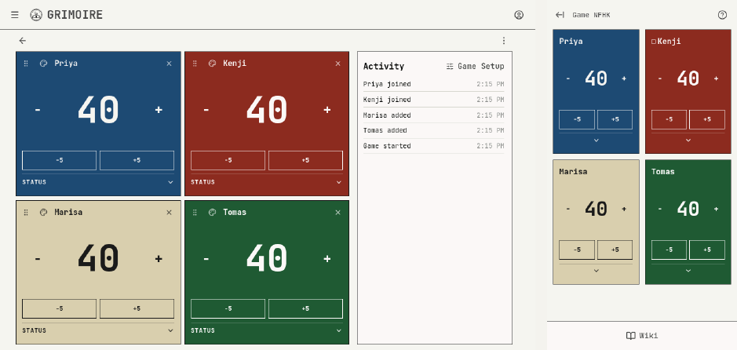
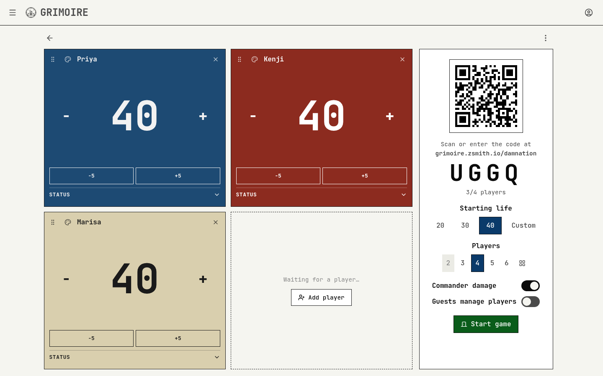
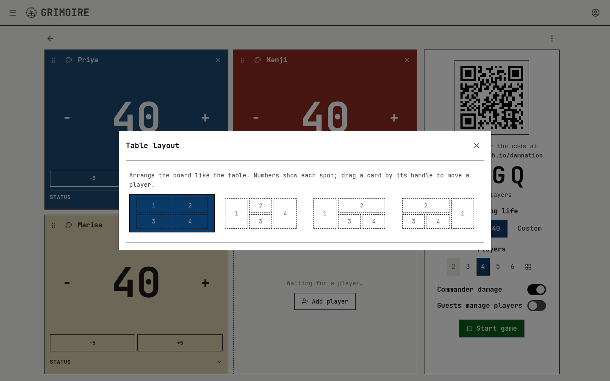
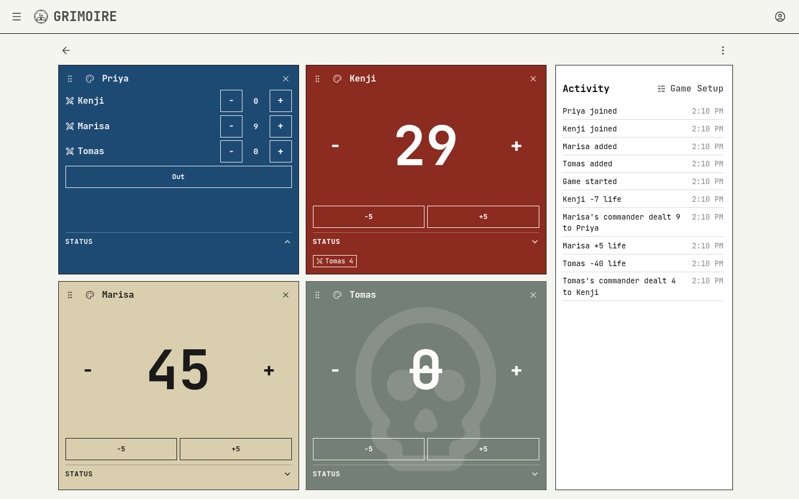
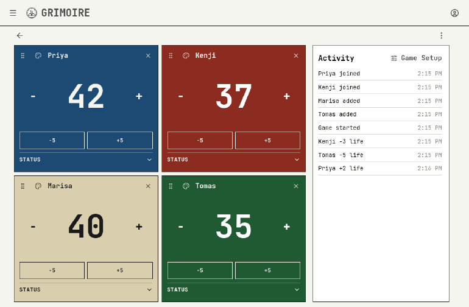
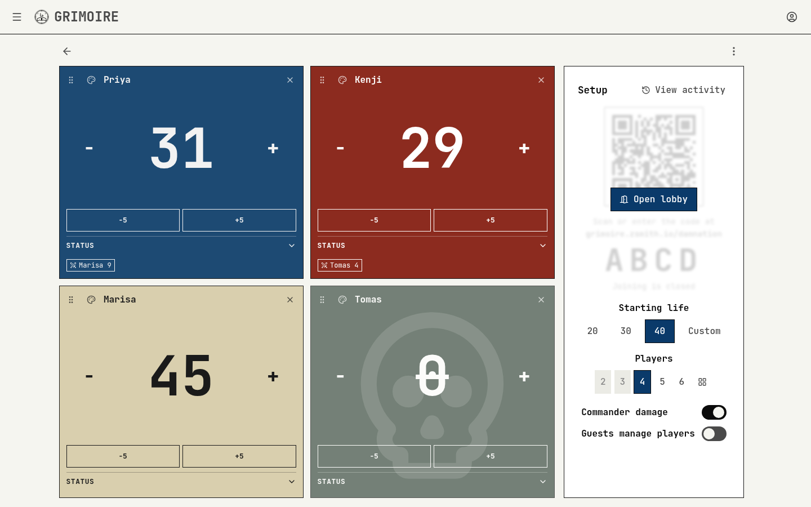
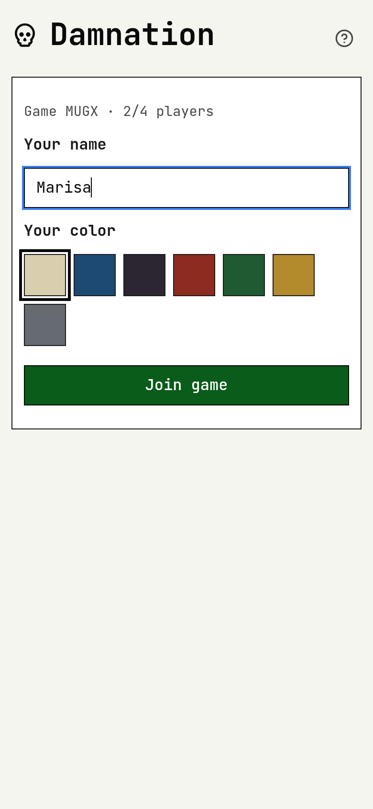
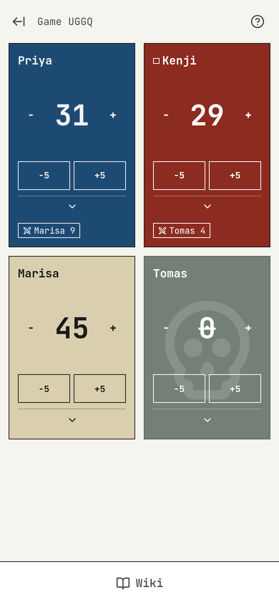

# DAMNATION

DAMNATION is a Magic: The Gathering (MTG) life tracker for a table of 2 to 6 players. A shared board shows every player's life total, commander damage, and status, and players join from their phones with a short code or QR code, without a GRIMOIRE account.


## Key Features

- **Shared Board**: The host's board arranges every player's card like the seats at the table, with a game card beside it that flips between the game setup and the activity feed.
- **Phone Controllers**: Players join from a phone with a code or QR code, no account needed, and see the same table layout as the board.
- **Open Editing**: Anyone in the game changes anyone's life, commander damage, and status, the way whoever is closest updates the count at a real table.
- **Live Updates**: Every change shows at once on the device that made it and reaches every other screen live; taps on the same counter are sent together after a 3-second pause.
- **Commander Damage**: Commander damage is tracked per opposing commander and also costs life; 21 from one commander puts a player out. It is switched per game, with a per-host default in settings.
- **Automatic Elimination**: A player is out at 0 life or 21 commander damage from one commander, shown as a skull across their card; **Out** and **Jump back in** cover conceding and corrections.
- **Table Layouts**: Layouts for each player count arrange the cards like the table, and the last layout picked for each count is remembered. Cards move by dragging their handle.
- **Lobby Control**: Starting the game closes the lobby and hides the join code; the lobby opens again for a late arrival without stopping the game.
- **Guest Player Management**: A per-game switch lets players add, rename, recolor, move, and remove players from their phones.
- **Activity Feed**: Every change is listed with its time; the entry's tooltip names who made it.
- **Wiki Search**: Card and rules lookup in a panel; wiki links stay in the panel, Scryfall card links show the card, and other sites open in a browser tab.
- **Resume and Reset**: An ended game resumes with its totals and a fresh join code, and **Reset game** starts the same table over at the starting life.



## Configuration

The wiki search site applies to every game on the server and is set in the environment file (`nextjs/.env.local`, see `nextjs/.env.template.local`).

```
DAMNATION_WIKI_SEARCH_TEMPLATE=https://mtg.wiki/index.php?search={query}&title=Special%3ASearch&go=Go
DAMNATION_WIKI_EMBED=true
```

| Key                            | Type    | Default           | Description                                                                                  |
| ------------------------------ | ------- | ----------------- | -------------------------------------------------------------------------------------------- |
| DAMNATION_WIKI_SEARCH_TEMPLATE | string  | mtg.wiki search † | Search address for the Wiki panel, with `{query}` where the search text goes.                |
| DAMNATION_WIKI_EMBED           | boolean | true              | Shows results in a panel inside DAMNATION when `true`, or opens them in a browser tab when `false`. |

† _used when blank or invalid_

1. Set the keys in `nextjs/.env.local`.
1. Restart GRIMOIRE.

## How to Use

### Hosting a Game

1. Open DAMNATION and select **Start game & open board**.
1. Choose the starting life, player count, table layout, commander damage, and guest player management on the setup card:

   

1. Have each player scan the QR code, or go to the join address on a phone and enter the code.
1. Select **Add player** in an open spot for a player without a phone, then select the name or palette on their card to rename or recolor them.
1. Pick a table layout with the grid button beside the player counts:

   

1. Select **Start game** to close the lobby.

### Playing

1. Select **−** or **+** beside a total to change it by 1, or **−5** and **+5** to change it by 5.
1. Open a card's **Status** section to record commander damage from each opponent, or mark the player **Out**:

   

1. Drag a card by its handle onto another card to swap the two players, or onto an open spot to move there:

   

1. Select **Game Setup** on the activity card to change the setup during the game, or **Open lobby** to let a late arrival join:

   

1. Use the ⋯ menu for the wiki, full screen, settings, help, **Reset game**, and **Delete game**.

### Joining From a Phone

1. Scan the board's QR code, or go to the join address and enter the code.
1. Enter a name, pick a color, and select **Join game**:

   

1. Change any player's life, commander damage, and status from their card; the phone shows the board's table layout:

   
